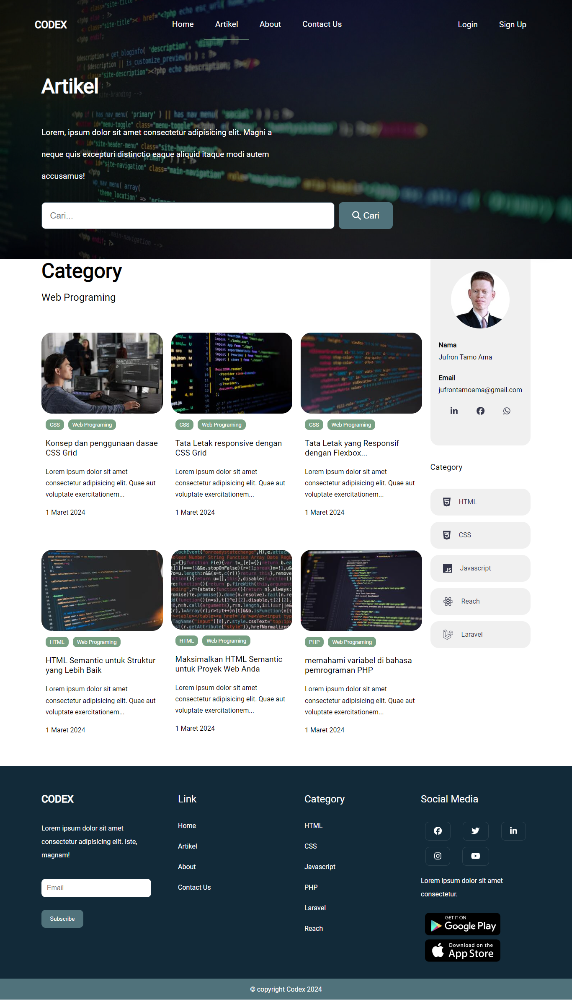
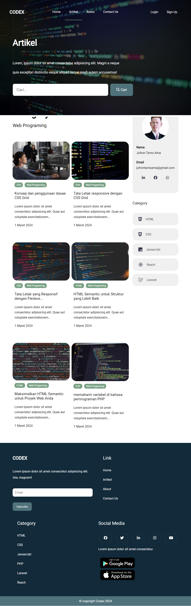
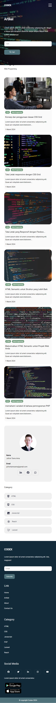

# Codex Landing Page

Codex is a landing page website built using HTML, SCSS, Typescript and vite js bunddler. The website is designed to provide an engaging and responsive user experience across various screen sizes.

## Key Features

- **Responsive Design**: Codex is developed with a focus on responsiveness, ensuring a polished display on devices ranging from desktops to mobile devices.
- **Smooth Animations**: The use of JavaScript to add smooth animations to specific elements enhances interactivity and visual appeal.
- **Easy Navigation**: Intuitive navigation menu to facilitate user exploration and content discovery.

## Technologies Used

- HTML
- SCSS
- Typescript
- vite js (bunddler)

## Screenshots

##### Dekstop

##### Tablet

##### Mobile
